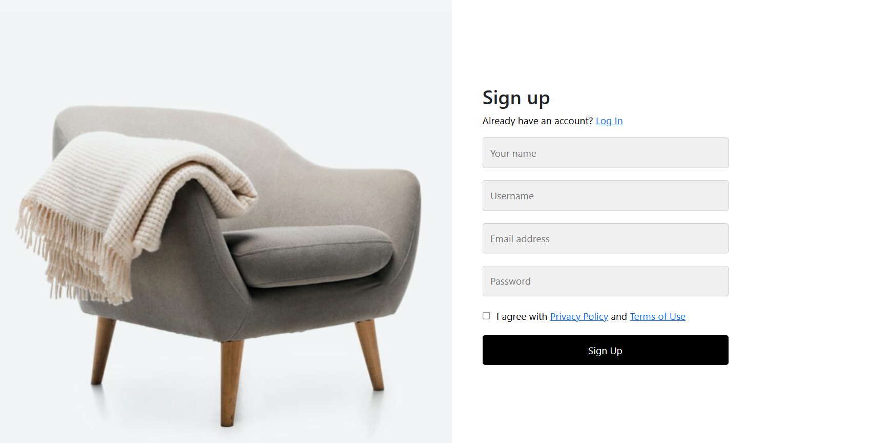
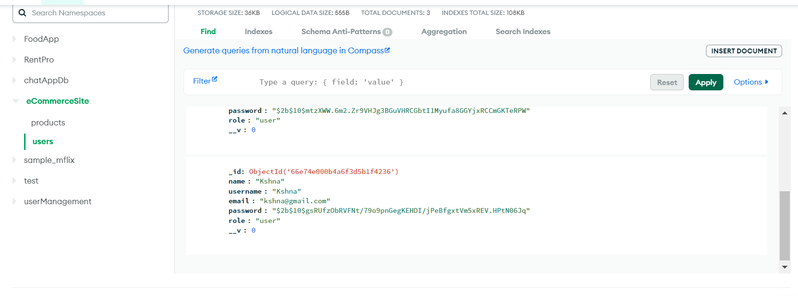
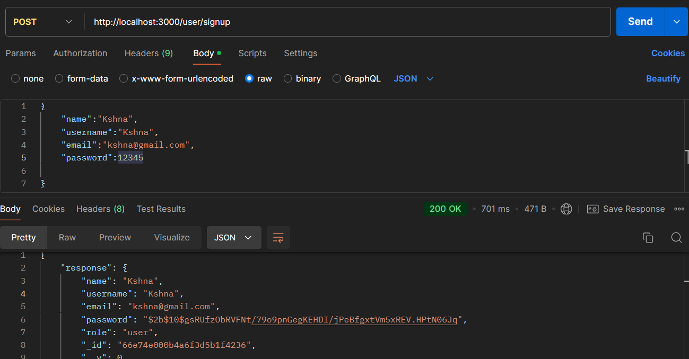
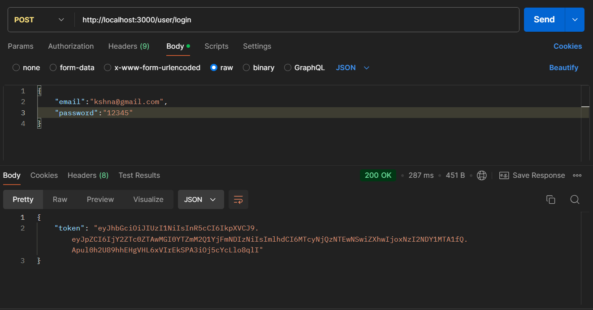
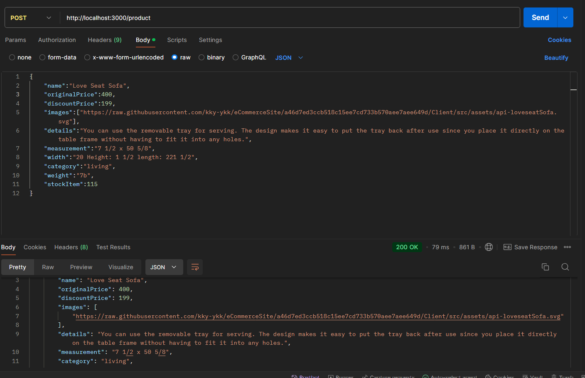
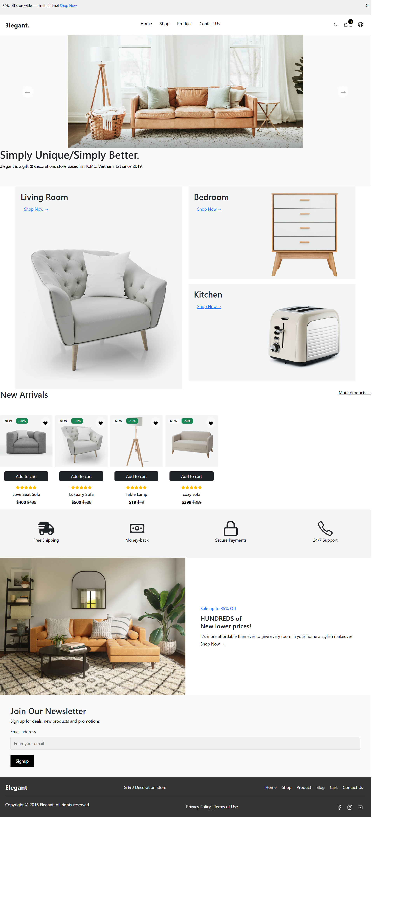
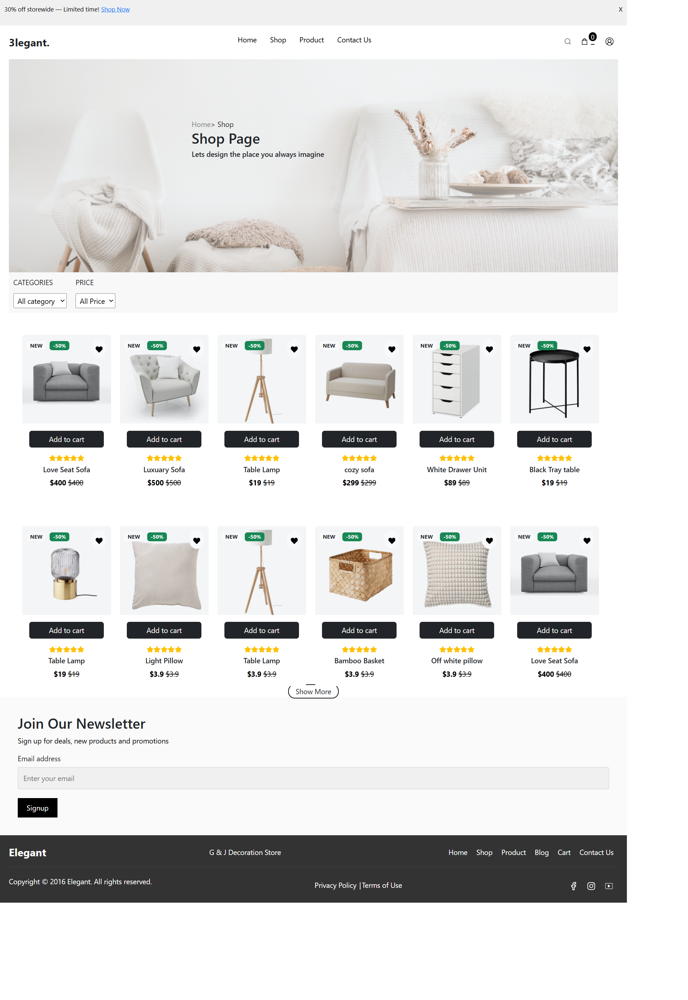
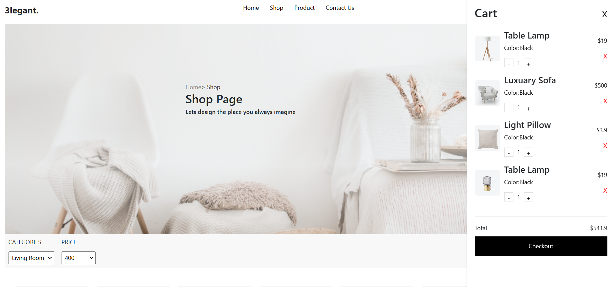

# eCommerce Website

This is a full-stack eCommerce website designed to allow users to register, log in, browse, filter, and purchase products. The website uses JWT for secure user authentication, bcrypt for password hashing, and MongoDB for storing user and product data.

## Features

### 1. User Authentication
- **Register a New User**: 
  - `POST /register`: Registers a new user by storing their credentials securely in the MongoDB database. Passwords are hashed using `bcrypt` before storage.
  
- **Login a User**: 
  - `POST /login`: Authenticates a user and returns a JWT token if the credentials match. 
  - **Sessions**: Upon login, a session is created that allows the user to navigate different pages securely.

### 2. Product Management
- **Retrieve All Products**: 
  - `GET /products`: Retrieves a list of all products available in the store.
  
- **Retrieve a Specific Product**: 
  - `GET /products/:id`: Retrieves detailed information about a specific product by its ID.
  
- **Filter Products**: 
  - Users can filter the product list on the shop page to find items based on specific criteria like price, category, and more.

### 3. Cart and Checkout
- Add and remove items from the cart.
- View the total cost and checkout securely.

## API Endpoints

### User Authentication Endpoints

- **Register a new user**: 
  ```http
  POST /user/signup

- **Login user**: 
  ```http
  POST /user/login

- **Add products**: 
  ```http
  POST /product

- **Get Products**: 
  ```http
  GET /product
  
- **Get Product**: 
  ```http
  GET /product:id


 - # Website References Images
 - User Registration Page
     
 - User Login Page
     
 - User Data In Mongodb
     
 - User SignUp endpoint
     
 -Token generation During login
        
 - Products Post to DB
     
 - Site Home Page
     
 - Website shop page
     

 - Website cart page
     
